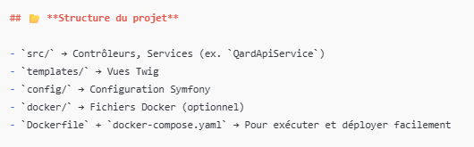
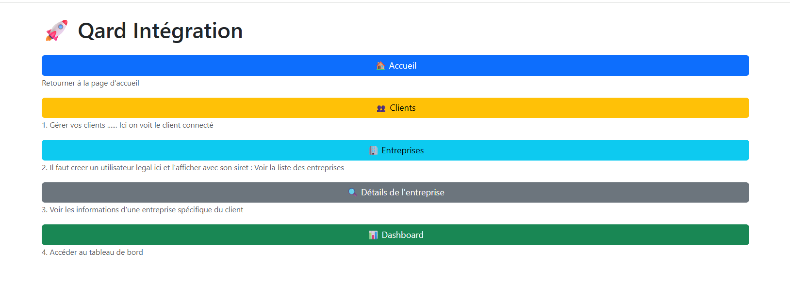
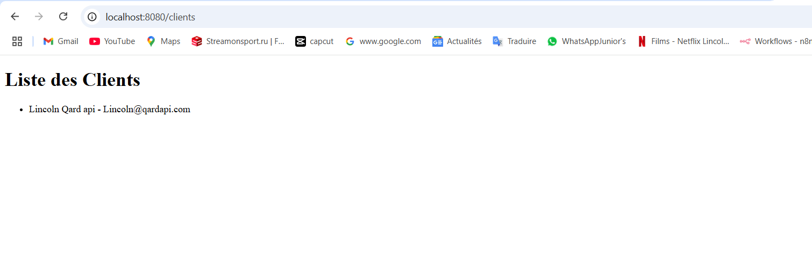
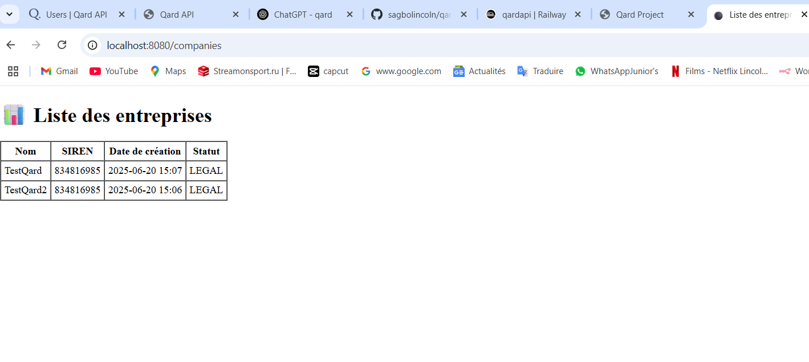
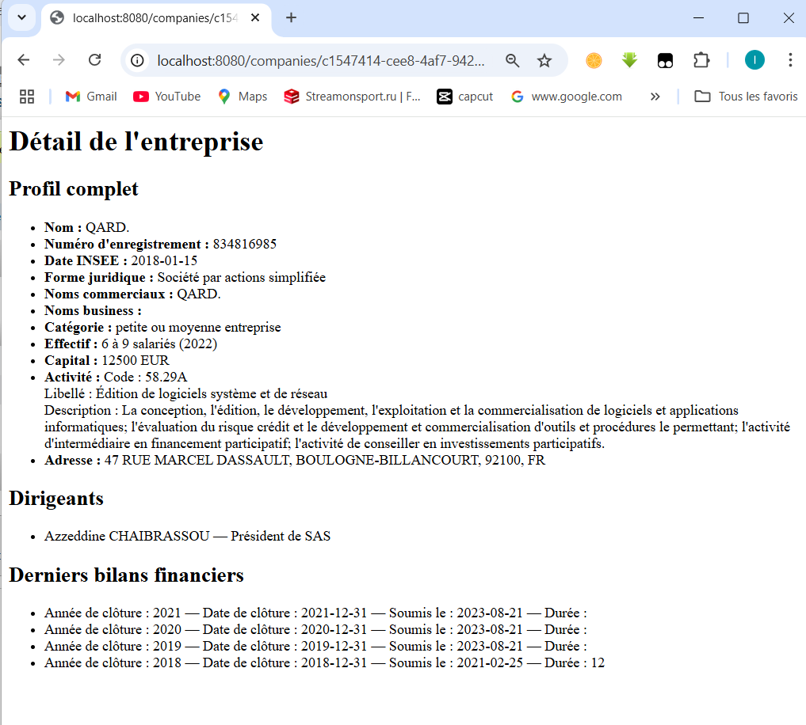
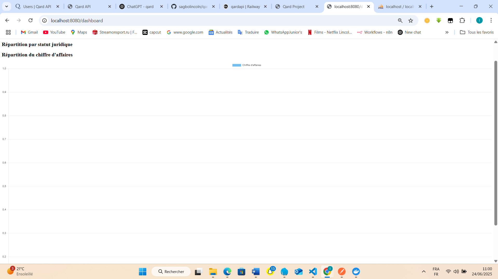
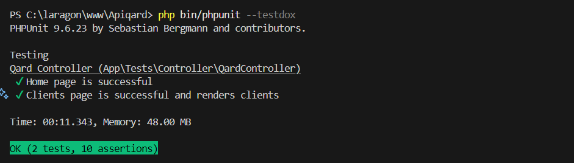

# 🚀 Qard Intégration

Bienvenue dans Qard, une application web basée sur Symfony qui intègre et affiche les données d'entreprises et de clients en utilisant l’API QardAPI.

## Fonctionnement
Cette application Symfony consomme l’API Qard pour :

Lister les clients et entreprises

Voir le détail d’une entreprise (profil, dirigeants, bilans)

Afficher les details sur l'entreprise via l'id

Ce projet est un exemple d’intégration complète : 
    -backend Symfony
    -frontend Bootstrap
    -routes dynamiques et 
    -bonnes pratiques de code.


## Fonctionnalités

 Page d’accueil claire et minimaliste  
 Menu de navigation responsive (Bootstrap)  
 Liste des clients  
 Liste des entreprises avec liens vers les détails  
 Fiche détaillée pour chaque entreprise  
 Dashboard pour visualiser les données  
 Appel de l’API QardAPI via un service Symfony (`qardApiService`)


## Arborescence du projet

---

### 📌 **2️⃣ Ajoute une section « 📂 Structure des fichiers »**

Beaucoup de relecteurs aiment avoir un aperçu :

```markdown
## 📂 Structure du projet

├── bin/
├── config/
├── docker/
├── migrations/
├── public/
├── src/
│   ├── Controller/
│   ├── Service/  # Contient QardApiService
├── templates/
├── tests/
├── var/
├── vendor/
├── .env
├── docker-compose.yml
├── Dockerfile
├── README.md



## Prérequis
PHP >= 8.1

Composer

Symfony CLI (optionnel mais recommandé)

Accès à l’API QardAPI (clé API)

## Installation

1️⃣ Cloner le projet

git clone https://github.com/sagbolincoln/qardapi
cd qardapi

2️⃣ Installer les dépendances PHP

composer install

3️⃣ Copier et configurer l’environnement

cp .env .env.local
Dans .env.local, configure ta clé API Qard :

## env

QARD_API_URL="https://api.preprod.qardfinance.com/api/v6"
QARD_API_KEY=" {{ Ta clée API }} "

## service.yaml

    App\Service\QardApiService:
        arguments:
            $baseUrl: '%env(QARD_API_URL)%'
            $apiKey: '%env(QARD_API_KEY)%'


4️⃣ Lancer le serveur Symfony

symfony server:start
ou avec PHP natif :

php -S localhost:8080 -t public
## Comment utiliser l'application
Accède à http://localhost:8000 ou http://localhost:8080

Clique sur les boutons du menu pour naviguer :

🏠 Accueil : C'est juste pour regrouper toutes les routes et acceder à ceux-ci via des buttons 


👥 Clients : {{\clients}}Verification de l'authentification 


🏢 Entreprises : j'ai crée 2 entreprises avec numero de sirets nom ect et j'ai affiche. 
## Comment ca marche ??
- creer les entrprises via Postman
- Importer ces entreprises dans la bd (/Command/ImportCompaniesCommand) dans la table companies 
- Recuperer les entreprises et les afficher 


🔍 Détail d’une entreprise : Ici on voit les details de l'entreprise 



📊 Dashboard : le dashboard 


##  Tests 

php bin/phpunit --testdox : pour lancer les test de mon application 


## Commandes utiles
Commande	                        Description
composer install	                Installer les dépendances
symfony server:start	            Lancer le serveur
php -S localhost:8080 -t public	    Serveur PHP natif
composer update	                    Mettre à jour les dépendances
composer dump-autoload	            Régénérer l’autoload
docker-compose down -v              Supprimer le conteneur
docker-compose up --build           Creer le conteneur 


## Contact
👤 Auteur : Lincoln SAGBO

📫 Email : lincolnsagbo11@gmail.com

🌍 LinkedIn : https://www.linkedin.com/in/lincoln2105/
